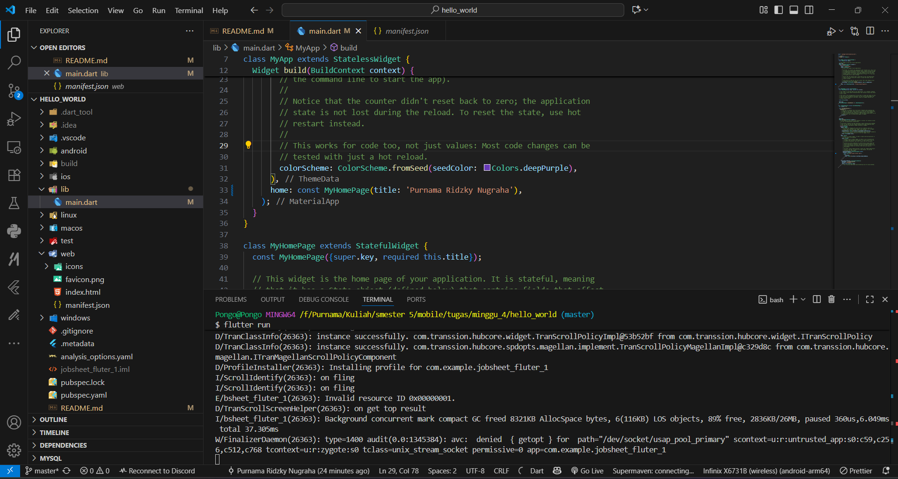

# praktikum 1
1. membuat app flutter baru
# praktikum 2 
menghubungakna flutter dengan android studio untuk mengakses hp fisik
1. menggunakan flutter sebelumnya 
2. membuka android studio 
3. mengatur hp agar menghubungkan dengan qr code 
4. menampilkan qr code yang ada di android studio 
5. scan  pakai hp dengan syarat di bawah wifi yang sama
6. menghubungkan hp dengan android studio
7. menjalankan aplikasi dari vscode dan menginstall aplikasi ke hp
8. tunggu beberapa menti lalu mengakses aplikasi dari hp
# praktikum 3 
1. menggunakan flutter sebelumnya 
2. membuat repo baru 
3. membuat git ignore lalu push ke repo 
4. membuat  readme.md lalu push ke repo
5. karena dari awal menggunakan folder hello world praktikum 1 jadi  file langsung ada di repo semua 
6. dalam praktikum ini saya menggunakan hp fisik untuk mengakses aplikasi yang dibuat di flutter
7. hasil ss 

  
  

